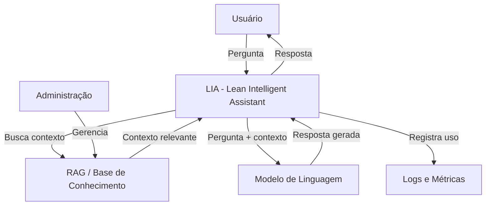
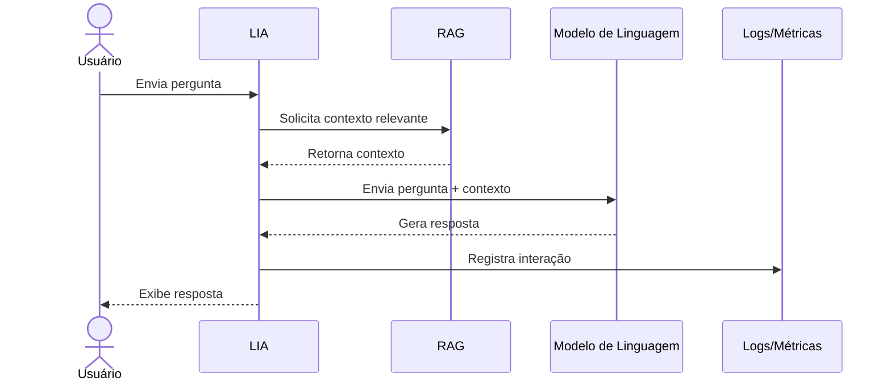

# LIA – Lean Intelligent Assistant

Documentação de discovery arquitetural do **LIA – Lean Intelligent Assistant**, utilizando a abordagem **Diagrams as Code** com Mermaid.

> **Objetivo:** criar uma base de documentação versionável que possa servir como contexto para futuras atividades de desenvolvimento e validação assistidas por IA.

---

## 1. Visão geral

O LIA é um assistente baseado em Inteligência Artificial Generativa que permite ao usuário realizar perguntas utilizando informações disponibilizadas em bases de conhecimento (RAG).

A aplicação combina uma interface de conversa, recuperação de informações relevantes e um modelo de linguagem para produzir respostas contextualizadas.

Esta documentação representa uma visão de **discovery**, e não pretende substituir especificações técnicas, contratos de API ou decisões arquiteturais oficiais.

---

## 2. Escopo

### Dentro do escopo

- Interação do usuário com o assistente;
- Envio de perguntas;
- Recuperação de informações em uma base RAG;
- Utilização do contexto recuperado para geração da resposta;
- Apresentação da resposta ao usuário;
- Administração das bases/RAGs disponíveis;
- Registro de informações relacionadas às interações e ao uso da aplicação.

### Fora do escopo

- Implementação detalhada do modelo de linguagem;
- Definição de infraestrutura/cloud;
- Detalhamento de banco de dados;
- Definição de contratos completos de APIs;
- Definição de regras de segurança que não estejam documentadas;
- Escolha definitiva de tecnologias não explicitamente conhecidas.

---

## 3. Nível da visão

Os diagramas deste repositório apresentam uma visão arquitetural simplificada, próxima de uma **visão de containers inspirada no modelo C4**.

O objetivo é mostrar os principais elementos envolvidos e suas responsabilidades, sem detalhar classes, funções ou implementação interna.

---

## 4. Atores e responsabilidades

| Elemento | Responsabilidade |
|---|---|
| Usuário | Realizar perguntas e consumir as respostas do assistente |
| LIA | Orquestrar a interação entre usuário, RAG e modelo de linguagem |
| RAG / Base de conhecimento | Disponibilizar contexto relevante para a pergunta |
| Modelo de linguagem | Gerar uma resposta utilizando a pergunta e o contexto recuperado |
| Administração | Gerenciar recursos relacionados às bases de conhecimento |
| Logs/Métricas | Registrar informações de uso e execução |

---

## 5. Limites do sistema

O LIA é responsável principalmente pela orquestração da experiência de consulta.

A base de conhecimento é tratada como uma fonte externa de contexto, enquanto o modelo de linguagem é responsável pela geração da resposta.

A documentação não assume que o LIA seja responsável pelo treinamento do modelo de linguagem.

---

## 6. Integrações

A visão atual considera as seguintes integrações principais:

1. **Base RAG:** recuperação de documentos/contextos relevantes;
2. **Modelo de linguagem:** processamento da pergunta e geração da resposta;
3. **Serviços de logs/métricas:** registro de informações relacionadas à utilização do sistema.

Os detalhes de autenticação, protocolos, endpoints, contratos e formatos de payload não foram definidos nesta etapa.

---

## 7. Restrições e premissas

- A resposta gerada depende da qualidade do contexto recuperado;
- O modelo de linguagem pode produzir respostas incorretas ou não suportadas pelo contexto;
- Nem todas as decisões arquiteturais estão disponíveis nesta documentação;
- Os diagramas representam uma visão simplificada;
- Informações inferidas pela GenAI foram revisadas antes de serem incorporadas à documentação.

---

## 8. Diagrama estrutural

O diagrama apresenta os principais componentes e suas relações.



Arquivo separado: [`diagrams/estrutura.mmd`](diagrams/estrutura.mmd)

---

## 9. Diagrama comportamental

### Jornada crítica: usuário realiza uma pergunta



Arquivo separado: [`diagrams/sequencia.mmd`](diagrams/sequencia.mmd)

---

## 10. Uso de GenAI

A primeira versão dos diagramas foi estruturada com apoio de GenAI a partir de uma descrição textual do sistema.

O modelo conseguiu inferir corretamente o fluxo principal:

**Usuário → LIA → RAG → Modelo de Linguagem → LIA → Usuário**

Também foi coerente a identificação de uma área administrativa e de mecanismos de registro de utilização.

---

## 11. O que precisou ser ajustado

A geração automática não deve ser considerada uma fonte definitiva da arquitetura.

Durante a revisão, os principais cuidados foram:

- remover detalhes que não estavam confirmados;
- evitar transformar inferências em decisões técnicas;
- manter a visão no nível de arquitetura solicitado pela atividade;
- separar responsabilidades de aplicação, RAG e modelo de linguagem;
- deixar explícitas as lacunas que ainda precisam de documentação;
- evitar assumir tecnologias, APIs ou infraestrutura sem evidência.

Essa revisão é importante porque um diagrama gerado por IA pode parecer tecnicamente plausível mesmo quando contém decisões que não existem no sistema real.

---

## 12. Lacunas identificadas

Para que um agente de desenvolvimento pudesse implementar o sistema com menor risco de inventar decisões, ainda seria necessário documentar:

### Regras de negócio
- Quem pode consultar cada RAG;
- Como um RAG é ativado/desativado;
- Regras para atualização da base;
- Comportamento quando não existe contexto relevante.

### APIs e integrações
- Endpoints;
- Métodos HTTP;
- Payloads;
- Respostas;
- Códigos de erro;
- Autenticação e autorização.

### Segurança
- Perfis e permissões;
- Controle de acesso;
- Tratamento de dados sensíveis;
- Auditoria.

### Requisitos não funcionais
- Tempo máximo de resposta;
- Disponibilidade;
- Limites de uso;
- Observabilidade;
- Custos esperados de utilização do modelo.

### Tratamento de erros
- Falha na recuperação do RAG;
- Indisponibilidade do modelo;
- Timeout;
- Ausência de contexto;
- Respostas não suportadas pelo contexto.

### Arquitetura técnica
- Tecnologias utilizadas;
- Estrutura dos serviços;
- Banco de dados;
- Infraestrutura;
- Ambientes;
- Estratégia de deploy.

---

## 13. Decisões para evitar alucinações da documentação

Uma premissa deste repositório é:

> **Quando uma informação não estiver confirmada, ela deve ser tratada como lacuna e não como decisão arquitetural.**

Dessa forma, a documentação diferencia:

- **Fato:** informação conhecida sobre o sistema;
- **Inferência:** informação sugerida pela GenAI;
- **Decisão:** informação validada e adotada;
- **Lacuna:** informação ainda não conhecida.

Essa separação torna o material mais seguro para uso futuro como contexto de agentes de desenvolvimento.

---

## 14. Conclusão

A atividade demonstrou que a abordagem **Diagrams as Code** facilita a criação de uma documentação versionável, revisável e reprodutível.

A GenAI foi útil para acelerar a criação da primeira versão dos diagramas, mas a revisão humana foi necessária para garantir aderência ao sistema real.

Para uma futura implementação assistida por agentes, o próximo passo seria complementar esta documentação com contratos de integração, regras de negócio, requisitos não funcionais, decisões arquiteturais e fluxos de exceção.

---

## 15. Estrutura do repositório

```text
lia-discovery-documentation/
├── README.md
└── diagrams/
    ├── estrutura.mmd
    └── sequencia.mmd
```

## 16. Status

**Discovery inicial — documentação arquitetural em evolução.**
